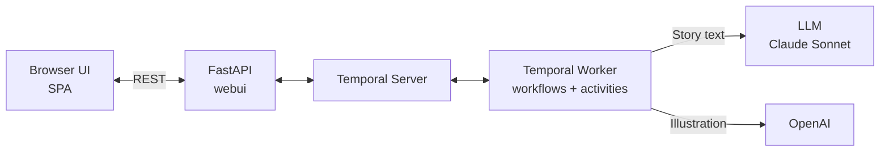

# Temporal Bedtime Agent

An interactive bedtime story creation agent powered by [Temporal](https://temporal.io/) durable execution and [Anthropic](https://www.anthropic.com/) LLM.

The agent guides you through a conversation to collaboratively create a personalized bedtime story, complete with AI-generated illustrations.

## Features

- Conversational story creation (character, theme, special elements)
- AI-generated bedtime stories (3 paragraphs)
- Automatic illustration generation from story descriptions
- Durable execution via Temporal (workflows survive failures and restarts)
- Multi-language support (the agent detects the user's language)

## Architecture



- **Web UI (webui)** — FastAPI backend that serves the single-page app and exposes a REST API. It receives user messages and forwards them to Temporal as signals.
- **Temporal Server** — Orchestrates the story creation workflow with durable execution. It guarantees that workflows survive failures and restarts, and coordinates communication between the web UI and the worker.
- **Worker** — Executes the workflows and activities. It drives the conversational flow, calls Claude Sonnet to generate story text, and calls OpenAI to generate illustrations.

## Prerequisites

- **Python 3.11+**
- **[uv](https://docs.astral.sh/uv/)** — fast Python package manager
- **Temporal Server** running locally (see below)
- **Anthropic API key** — for story generation (Claude)
- **OpenAI API key** — for illustration generation (DALL-E)

## Getting Started

### 1. Configure Environment Variables

```bash
cp .env-sample .env
```

Edit `.env` and fill in your API keys:

| Variable | Description | Default |
|---|---|---|
| `ANTHROPIC_API_KEY` | Anthropic API key (required) | — |
| `OPENAI_API_KEY` | OpenAI API key for image generation (required) | — |
| `PYDANTIC_AI_MODEL` | LLM model identifier | `anthropic:claude-sonnet-4-6` |
| `PYDANTIC_AI_IMAGE_MODEL` | Image generation model | `openai-responses:gpt-image-1-mini` |
| `TEMPORAL_ADDRESS` | Temporal server address | `localhost:7233` |
| `TEMPORAL_TASK_QUEUE` | Temporal task queue name | `bedtime-story` |
| `WEBUI_HOST` | Web UI bind address | `0.0.0.0` |
| `WEBUI_PORT` | Web UI port | `8000` |

### 2. Run with Docker Compose

```bash
docker-compose up --build
```

This starts the Temporal server, the worker, and the web UI. Open [http://localhost:8000](http://localhost:8000) to start creating a story, and [http://localhost:8233](http://localhost:8233) for the Temporal dashboard.

### 3. Run without Docker

#### Install Dependencies

```bash
uv sync
```

#### Run the Application

Start each command in a separate terminal:

```bash
# Terminal 1 — Temporal Server
temporal server start-dev

# Terminal 2 — Temporal Worker
uv run worker

# Terminal 3 — Web UI
uv run webui
```

Then open [http://localhost:8000](http://localhost:8000) in your browser and start creating a bedtime story!

> You need the [Temporal CLI](https://docs.temporal.io/cli) to run `temporal server start-dev`.

## Development

### Dev Workflow

The recommended way to develop is to run each component separately so you get hot-reload and direct log output.

```bash
# 1. Install dependencies (including dev extras)
uv sync

# 2. Start the Temporal dev server (requires the Temporal CLI)
temporal server start-dev

# 3. Start the worker (auto-reloads on file changes via watchfiles)
uv run worker

# 4. Start the web UI (auto-reloads on file changes via uvicorn)
uv run webui
```

Each command runs in its own terminal. The worker watches `worker/` and `webui/` directories; any saved change restarts it automatically. The web UI reloads on changes to `webui/` and `static/`.

Open [http://localhost:8000](http://localhost:8000) for the app and [http://localhost:8233](http://localhost:8233) for the Temporal dashboard.

### Debugging

#### Temporal Dashboard

The Temporal dev server exposes a web dashboard at [http://localhost:8233](http://localhost:8233) where you can:

- List and inspect running/completed workflows
- View workflow execution history (events, signals, queries)
- Send signals or queries to a running workflow manually

#### Logs

Both the worker and the web UI use `structlog` with JSON output. Filter logs by component:

```bash
# Worker logs include events like "Connecting to Temporal", "Worker started"
uv run worker 2>&1 | jq .

# Web UI logs include events like "Creating session", "Message sent"
uv run webui 2>&1 | jq .
```

#### Common Issues

| Symptom | Cause | Fix |
|---|---|---|
| `Connection refused` on port 7233 | Temporal server not running | Start it with `temporal server start-dev` |
| Worker starts but no workflows execute | Task queue mismatch | Check `TEMPORAL_TASK_QUEUE` matches in `.env` |
| `ANTHROPIC_API_KEY` / `OPENAI_API_KEY` errors | Missing or invalid API keys | Verify keys in `.env` |
| Illustration not generated | OpenAI API key missing or model unavailable | Check `OPENAI_API_KEY` and `PYDANTIC_AI_IMAGE_MODEL` in `.env` |

## Project Structure

```
├── worker/          # Temporal worker: workflows, activities, AI agents
├── webui/           # FastAPI REST API serving the frontend
├── static/          # Single-page app (HTML, JS, CSS)
├── pyproject.toml   # Project metadata and dependencies
└── .env-sample      # Environment variable template
```

## License

[Apache License 2.0](LICENSE)
