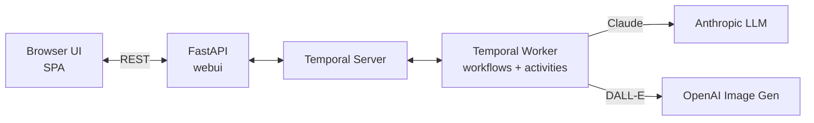

# Temporal Bedtime Agent

An interactive bedtime story creation agent powered by [Temporal](https://temporal.io/) durable execution and [Anthropic](https://www.anthropic.com/) LLM.

The agent guides you through a conversation to collaboratively create a personalized bedtime story, complete with AI-generated illustrations.

## Features

- Conversational story creation (character, theme, special elements)
- AI-generated bedtime stories (3 paragraphs)
- Automatic illustration generation from story descriptions
- Durable execution via Temporal (workflows survive failures and restarts)
- Multi-language support (the agent detects the user's language)

## Architecture



## Prerequisites

- **Python 3.11+**
- **[uv](https://docs.astral.sh/uv/)** — fast Python package manager
- **Temporal Server** running locally (see below)
- **Anthropic API key** — for story generation (Claude)
- **OpenAI API key** — for illustration generation (DALL-E)

## Getting Started

### 1. Start a Temporal Server

The easiest way is to use the [Temporal CLI](https://docs.temporal.io/cli):

```bash
temporal server start-dev
```

This starts a local Temporal server on `localhost:7233`.

### 2. Configure Environment Variables

```bash
cp .env-sample .env
```

Edit `.env` and fill in your API keys:

| Variable | Description | Default |
|---|---|---|
| `ANTHROPIC_API_KEY` | Anthropic API key (required) | — |
| `OPENAI_API_KEY` | OpenAI API key for image generation (required) | — |
| `PYDANTIC_AI_MODEL` | LLM model identifier | `anthropic:claude-sonnet-4-6-20250627` |
| `PYDANTIC_AI_IMAGE_MODEL` | Image generation model | `openai-responses:gpt-image-1-mini` |
| `TEMPORAL_ADDRESS` | Temporal server address | `localhost:7233` |
| `TEMPORAL_TASK_QUEUE` | Temporal task queue name | `bedtime-story` |
| `WEBUI_HOST` | Web UI bind address | `0.0.0.0` |
| `WEBUI_PORT` | Web UI port | `8000` |

### 3. Install Dependencies

```bash
uv sync
```

### 4. Run the Application

Start the worker (which also serves the web UI):

```bash
uv run worker
```

Or run the web UI and worker separately in two terminals:

```bash
# Terminal 1 — Web UI
uv run webui

# Terminal 2 — Temporal Worker
uv run worker
```

Then open [http://localhost:8000](http://localhost:8000) in your browser and start creating a bedtime story!

## Project Structure

```
├── worker/          # Temporal worker: workflows, activities, AI agents
├── webui/           # FastAPI REST API serving the frontend
├── static/          # Single-page app (HTML, JS, CSS)
├── pyproject.toml   # Project metadata and dependencies
└── .env-sample      # Environment variable template
```

## License

[Apache License 2.0](LICENSE)
